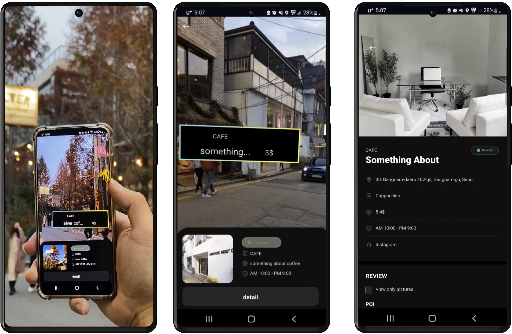

# LOOKTAB 

### LOOKTAB Mobile DApp

- On the user interface level, we created a mobile DApp using Android that enables users to manage their Near Wallet and NFT Reward.
- Users can get NFT Rewards from Airdrop and redeem them in offline stores. Store owners can check their ownership of reward from their wallet id.
- Users can get additional incentives when they contribute to LOOKTAP ecosystem by reviewing some stores and adding useful information.

### Hyper Local AR Service

- Users can easily access the reviews posted by their neighbors.

### AR Camera

-Users can quickly grasp the information of the store with AR seen through the camera

### Market Reiew

- Write a review for the stores you checked in

## License

MIT License
